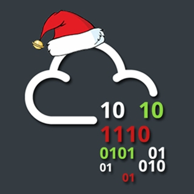

# [Day 6] Data Elf-iltration 
## Description

[Download](files/holidaythief.pcap)

"McElferson! McElferson! Come quickly!" yelled Elf-ministrator.

"What is it Elf-ministrator?" McElferson replies.

"Data has been stolen off of our servers!" Elf-ministrator says!

"What was stolen?" She replied.

"I... I'm not sure... They hid it very well, all I know is something is missing" they replied.

"I know just who to call" said McElferson...

Check out the supporting material [here](https://docs.google.com/document/d/17vU134ZfKiiE-DgiynrO0MySo4_VCGCpw2YJV_Kp3Pk/edit?usp=sharing).

Challenge and supporting material created by [Sq00ky](https://twitter.com/MrS1n1st3r).

## #1 - What data was exfiltrated via DNS?

We can extract all DNS requests using `tshark` as follows:
~~~
$ tshark -r holidaythief.pcap -Y "dns" -T fields -e dns.qry.name
43616e64792043616e652053657269616c204e756d6265722038343931.holidaythief.com
43616e64792043616e652053657269616c204e756d6265722038343931.holidaythief.com
43616e64792043616e652053657269616c204e756d6265722038343931.holidaythief.com
43616e64792043616e652053657269616c204e756d6265722038343931.holidaythief.com
43616e64792043616e652053657269616c204e756d6265722038343931.holidaythief.com
43616e64792043616e652053657269616c204e756d6265722038343931.holidaythief.com
google.com
google.com
43616e64792043616e652053657269616c204e756d6265722038343931.holidaythief.com
43616e64792043616e652053657269616c204e756d6265722038343931.holidaythief.com
google.com
google.com
sb-ssl.google.com
sb-ssl.google.com
wpad.nycap.rr.com
wpad.nycap.rr.com
wpad.nycap.rr.com
wpad.nycap.rr.com
sb-ssl.google.com
sb-ssl.google.com
sb-ssl.google.com
sb-ssl.google.com
~~~

The first requests contain a hex string:
~~~
$ echo "43616e64792043616e652053657269616c204e756d6265722038343931" | xxd -r -p
Candy Cane Serial Number 8491
~~~

This is the message that has been exfiltrated.

## #2 - What did Little Timmy want to be for Christmas?

Still using `tshark`, we can see that there are 3 HTTP requests, involving 2 files (`christmaslists.zip` and `TryHackMe.jpg`):

~~~
$ tshark -r holidaythief.pcap -Y "http" -T fields -e text
Timestamps,GET / HTTP/1.1\r\n,\r\n
Timestamps,HTTP/1.0 200 OK\r\n,\r\n,<!DOCTYPE html PUBLIC "-//W3C//DTD HTML 3.2 Final//EN"><html>\n,<title>Directory listing for /</title>\n,<body>\n,<h2>Directory listing for /</h2>\n,
\n,<ul>\n,<li><a href="christmaslists.zip">christmaslists.zip</a>\n,<li><a href="TryHackMe.jpg">TryHackMe.jpg</a>\n,</ul>\n,
\n,</body>\n,</html>\n
Timestamps,GET /christmaslists.zip HTTP/1.1\r\n,\r\n
Timestamps,HTTP/1.0 200 OK\r\n,\r\n
Timestamps,GET /TryHackMe.jpg HTTP/1.1\r\n,\r\n
Timestamps,HTTP/1.0 200 OK\r\n,\r\n
~~~

In Wireshark, we can easily extract these 2 files (File > Export Objects > HTTP):
* ["christmaslists.zip"](files/christmaslists.zip)
* ["TryHackMe.jpg"](files/TryHackMe.jpg)

The first file is a password protected zip archive:

~~~
$ unzip christmaslists.zip 
Archive:  christmaslists.zip
[christmaslists.zip] christmaslistdan.tx password: 
~~~

Let's crack it with John the Ripper:
~~~
$ ./zip2john christmaslists.zip > christmaslists.hash
$ ./john christmaslists.hash 
Using default input encoding: UTF-8
Loaded 1 password hash (PKZIP [32/64])
Will run 8 OpenMP threads
Proceeding with single, rules:Single
Press 'q' or Ctrl-C to abort, almost any other key for status
Warning: Only 3 candidates buffered for the current salt, minimum 8 needed for performance.
Warning: Only 4 candidates buffered for the current salt, minimum 8 needed for performance.
Warning: Only 3 candidates buffered for the current salt, minimum 8 needed for performance.
Warning: Only 4 candidates buffered for the current salt, minimum 8 needed for performance.
Almost done: Processing the remaining buffered candidate passwords, if any.
Proceeding with wordlist:/data/src/john-1.9.0-jumbo-1/run/password.lst, rules:Wordlist
december         (christmaslists.zip)
1g 0:00:00:00 DONE 2/3 (2020-05-02 07:27) 6.666g/s 471186p/s 471186c/s 471186C/s 123456..faithfaith
Use the "--show" option to display all of the cracked passwords reliably
Session completed
~~~

The password is `december`. Let's unzip:

~~~
$ unzip christmaslists.zip 
Archive:  christmaslists.zip
[christmaslists.zip] christmaslistdan.tx password: 
 extracting: christmaslistdan.tx     
  inflating: christmaslistdark.txt   
  inflating: christmaslistskidyandashu.txt  
  inflating: christmaslisttimmy.txt  
$ cat christmaslisttimmy.txt 
Dear Santa,
For Christmas I would like to be a PenTester! Not the Bic kind!
Thank you,
Little Timmy.
~~~

Little Timmy wants a `Pentester` for Christmas.

## #3 - What was hidden within the file?

The second file is a jpg image ([TryHackMe.jpg](files/TryHackMe.jpg)):

.

Submitting the file to https://futureboy.us/stegano/decinput.html reveals the following text:

~~~
                              ARPAWOCKY
			       RFC527

                    Twas brillig, and the Protocols
                         Did USER-SERVER in the wabe.
                    All mimsey was the FTP,
                         And the RJE outgrabe,

                    Beware the ARPANET, my son;
                         The bits that byte, the heads that scratch;
                    Beware the NCP, and shun
                         the frumious system patch,

                    He took his coding pad in hand;
                         Long time the Echo-plex he sought.
                    When his HOST-to-IMP began to limp
                         he stood a while in thought,

                    And while he stood, in uffish thought,
                         The ARPANET, with IMPish bent,
                    Sent packets through conditioned lines,
                         And checked them as they went,

                    One-two, one-two, and through and through
                         The IMP-to-IMP went ACK and NACK,
                    When the RFNM came, he said "I'm game",
                         And sent the answer back,

                    Then hast thou joined the ARPANET?
                         Oh come to me, my bankrupt boy!
                    Quick, call the NIC! Send RFCs!
                         He chortled in his joy.

                    Twas brillig, and the Protocols
                         Did USER-SERVER in the wabe.
                    All mimsey was the FTP,
                         And the RJE outgrabe.

                                                            D.L. COVILL
                                                            May 1973
~~~

This is `rfc527`
~~~
Answer: rfc527
~~~
